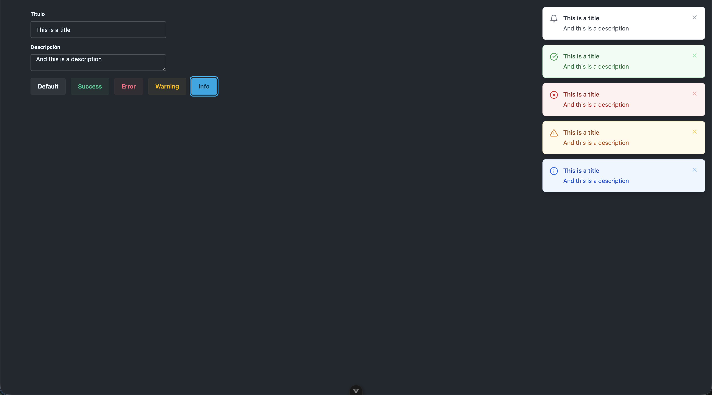

# Tostado 🍞

Un componente web de notificaciones toast premium, ligero y altamente personalizable construido con [Lit](https://lit.dev/).

Tostado funciona sin problemas en todos los frameworks frontend modernos (React, Vue, Angular, Svelte) y JavaScript vanilla.

*Leer esto en otros idiomas: [English (Inglés)](README.md).*

<p align="center">
  
</p>

---

## Características

- 💅 **Altamente personalizable**: Personaliza cualquier aspecto visual mediante propiedades personalizadas CSS (variables).
- 🧩 **Independiente del Framework**: Funciona en cualquier lugar donde se soporten elementos personalizados (Custom Elements).
- 🦄 **Tipado Primero**: Escrito completamente en TypeScript con archivos de declaración auto-generados.
- 🎨 **Estados visuales premium**: Temas predefinidos limpios y estéticos para estados `success` (éxito), `error`, `warning` (advertencia), `info` y `default` (por defecto).
- ⚡ **Ligero y de alto rendimiento**: Construido sobre Lit para garantizar un tamaño de bundle mínimo y tiempos óptimos de renderizado.
- ♿ **Accesible**: Incluye roles de accesibilidad semántica (`aria-live`, `role="status"`/`role="region"`) y botones de cierre interactivos con foco visible para teclado.

---

## Instalación

Instala el paquete utilizando tu gestor de paquetes favorito:

```bash
# npm
npm install tostado

# pnpm
pnpm add tostado

# yarn
yarn add tostado
```

---

## Uso Básico

### 1. Registrar el componente
Simplemente importa el paquete para registrar el elemento personalizado `<tostado-toast>`:

```typescript
import 'tostado';
```

### 2. Incluir en tu HTML / Plantilla
Añade el elemento personalizado a tu página. Este elemento actúa como un portal que administra y muestra la lista de notificaciones flotantes.

```html
<tostado-toast id="toast-container"></tostado-toast>
```

### 3. Agregar y Gestionar Toasts
El componente `<tostado-toast>` recibe notificaciones a través de la propiedad `toasts`. A continuación se muestra un ejemplo en JavaScript Vanilla de cómo añadir notificaciones y escuchar el evento cuando son descartadas:

```html
<script type="module">
  import 'tostado';

  const container = document.getElementById('toast-container');
  
  // Arreglo para almacenar las notificaciones activas
  let activeToasts = [];

  // Función para disparar una notificación
  function triggerToast(type, title, description) {
    const newToast = {
      id: Date.now().toString(), // Debe ser único
      title,
      description,
      type // 'success', 'error', 'warning', 'info', o 'default'
    };

    activeToasts = [...activeToasts, newToast];
    container.toasts = activeToasts;
  }

  // DEBES escuchar el evento 'remove-toast' para actualizar el estado de tu aplicación
  container.addEventListener('remove-toast', (event) => {
    const dismissedId = event.detail.id;
    activeToasts = activeToasts.filter(toast => toast.id !== dismissedId);
    container.toasts = activeToasts;
  });

  // Ejemplo de activación:
  triggerToast('success', '¡Cambios guardados!', 'Tu espacio de trabajo se ha sincronizado correctamente.');
</script>
```

---

## Ejemplos de Integración

### Vue 3
```html
<script setup>
import { ref } from 'vue';
import 'tostado';

const toasts = ref([]);

const showNotification = (type) => {
  toasts.value = [...toasts.value, {
    id: crypto.randomUUID(),
    title: '¡Éxito!',
    description: 'La acción se completó correctamente.',
    type
  }];
};

const handleRemove = (event) => {
  toasts.value = toasts.value.filter(t => t.id !== event.detail.id);
};
</script>

<template>
  <tostado-toast :toasts="toasts" @remove-toast="handleRemove"></tostado-toast>
  <button @click="showNotification('success')">Mostrar Éxito</button>
</template>
```

### React
```jsx
import React, { useState, useEffect, useRef } from 'react';
import 'tostado';

export function App() {
  const [toasts, setToasts] = useState([]);
  const containerRef = useRef(null);

  const addToast = (type) => {
    setToasts(prev => [
      ...prev,
      {
        id: Math.random().toString(),
        title: 'Nuevo Evento',
        description: '¡Algo sucedió en la aplicación!',
        type
      }
    ]);
  };

  useEffect(() => {
    const container = containerRef.current;
    if (container) {
      container.toasts = toasts;
    }
  }, [toasts]);

  useEffect(() => {
    const container = containerRef.current;
    
    const handleRemove = (event) => {
      setToasts(prev => prev.filter(t => t.id !== event.detail.id));
    };

    if (container) {
      container.addEventListener('remove-toast', handleRemove);
    }
    return () => {
      if (container) {
        container.removeEventListener('remove-toast', handleRemove);
      }
    };
  }, []);

  return (
    <div>
      <tostado-toast ref={containerRef}></tostado-toast>
      <button onClick={() => addToast('info')}>Mostrar Info</button>
    </div>
  );
}
```

---

## Referencia de la API

### Propiedades del Componente

| Propiedad | Tipo | Por Defecto | Descripción |
| :--- | :--- | :--- | :--- |
| `toasts` | `Toast[]` | `[]` | Arreglo de notificaciones toast a renderizar. |
| `timer` | `number` | `5000` | Tiempo en milisegundos antes de que una notificación se descarte automáticamente. |

### Eventos del Componente

| Nombre del Evento | Tipo de Detalle | Descripción |
| :--- | :--- | :--- |
| `remove-toast` | `{ id: string \| number }` | Se emite cuando un toast se cierra manualmente o expira su temporizador. **Debes** escuchar este evento y filtrar el arreglo de tu estado para remover el toast. |

### La Interfaz `Toast`

```typescript
export interface Toast {
  id: number | string; // Identificador único (crucial para animaciones y transiciones)
  title: string;       // Título en texto negrita
  description: string; // Detalle o descripción de la notificación
  type?: 'success' | 'error' | 'warning' | 'info' | 'default'; // Tipo de tema visual
}
```

---

## Estilos y Personalización (Variables CSS)

Tostado utiliza la encapsulación de Shadow DOM, pero expone una amplia gama de Variables CSS para que puedas personalizar la apariencia globalmente o en instancias individuales de contenedores.

### Personalización General y de Diseño

| Variable | Valor por Defecto | Descripción |
| :--- | :--- | :--- |
| `--tostado-toast-top` | `1rem` | Margen superior del contenedor |
| `--tostado-toast-right` | `1rem` | Margen derecho del contenedor |
| `--tostado-toast-bottom` | `auto` | Margen inferior del contenedor |
| `--tostado-toast-left` | `auto` | Margen izquierdo del contenedor |
| `--tostado-toast-z-index` | `9999` | Índice Z (Z-index) del contenedor |
| `--tostado-toast-width` | `350px` | Ancho de la tarjeta del toast |
| `--tostado-toast-radius` | `0.5rem` | Radio de los bordes (border-radius) |
| `--tostado-toast-padding` | `1rem` | Relleno interno (padding) |
| `--tostado-toast-font` | `system-ui, ...` | Tipografía (font-family) |
| `--tostado-toast-shadow` | `0 10px 15px -3px ...` | Sombra de caja estándar |
| `--tostado-toast-hover-shadow` | `0 20px 25px -5px ...` | Sombra al pasar el cursor (hover) |
| `--tostado-toast-border` | `1px solid #e5e7eb` | Borde estándar |
| `--tostado-toast-bg` | `#ffffff` | Fondo de tarjeta estándar |
| `--tostado-toast-color` | `#1f2937` | Color de texto estándar |

### Personalización de Estados y Temas

Para la personalización de temas específicos, las variables siguen la nomenclatura `--tostado-toast-{tipo}-{propiedad}`. Los tipos soportados son `success`, `error`, `warning`, `info` y `default`.

#### Ejemplo del Tema Éxito (Success)
- `--tostado-toast-success-bg` (Defecto: `#f0fdf4`)
- `--tostado-toast-success-border` (Defecto: `#bbf7d0`)
- `--tostado-toast-success-color` (Defecto: `#166534`)
- `--tostado-toast-success-description-color` (Defecto: `#15803d`)
- `--tostado-toast-success-icon-color` (Defecto: `#16a34a`)
- `--tostado-toast-success-close-color` (Defecto: `#86efac`)
- `--tostado-toast-success-close-hover-color` (Defecto: `#166534`)
- `--tostado-toast-success-close-hover-bg` (Defecto: `#dcfce7`)

#### Ejemplo del Tema Error
- `--tostado-toast-error-bg` (Defecto: `#fef2f2`)
- `--tostado-toast-error-border` (Defecto: `#fee2e2`)
- `--tostado-toast-error-color` (Defecto: `#991b1b`)
- `--tostado-toast-error-description-color` (Defecto: `#b91c1c`)
- `--tostado-toast-error-icon-color` (Defecto: `#dc2626`)
- `--tostado-toast-error-close-color` (Defecto: `#fca5a5`)
- `--tostado-toast-error-close-hover-color` (Defecto: `#991b1b`)
- `--tostado-toast-error-close-hover-bg` (Defecto: `#fee2e2`)

*(El mismo patrón aplica para los estados `warning`, `info` y `default`. Echa un vistazo al código de [tostado-toast.ts](file:///Users/mkeort/projects/tostado/src/tostado-toast.ts) para ver todos los estilos.)*

---

## Desarrollo Local

Si deseas contribuir o hacer pruebas con el componente Tostado:

1. Clona el repositorio.
2. Instala las dependencias:
   ```bash
   pnpm install
   ```
3. Ejecuta el servidor de desarrollo local (inicia una aplicación demo interactiva en `index.html`):
   ```bash
   pnpm dev
   ```
4. Compila el paquete para distribución:
   ```bash
   pnpm build
   ```

## Licencia

MIT
